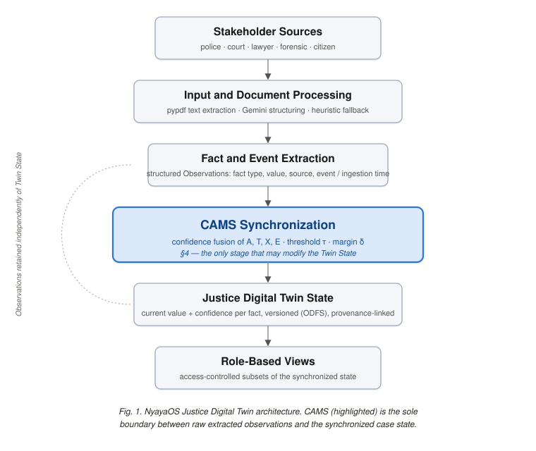
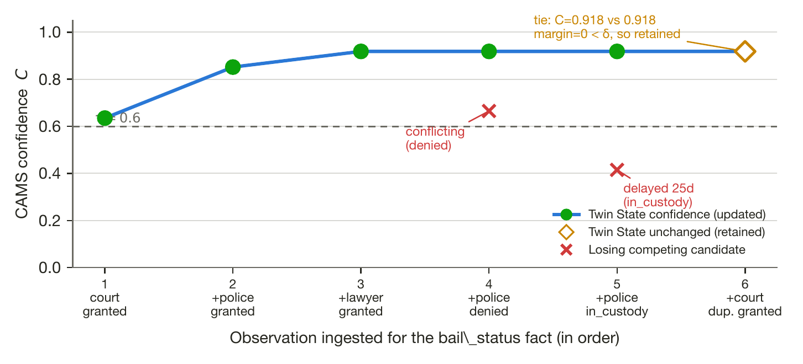
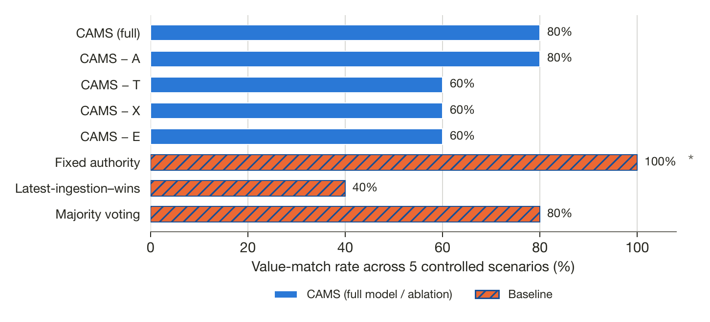
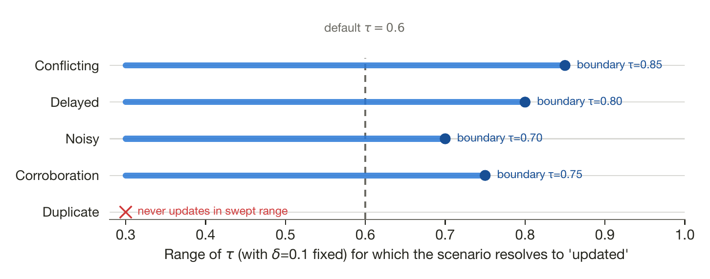

# NyayaOS: Confidence-Aware Multi-Source Synchronization for Justice Digital Twins

Khushi Shetty, Isha Rajmohan, Dhravya Shetty
Department of Computer Science & Engineering, Dayananda Sagar College of Engineering, Bangalore, India

*Revised manuscript — see `NyayaOS_CAMS_Audit.md` for the verification trail behind every number in this version.*

---

## Abstract

A legal case is not produced by a single record-keeper. Police, courts, lawyers,
and forensic agencies each generate case information independently and at
different times, and no one source is authoritative for every fact about a case.
Existing legal information systems support document storage, retrieval, and
question answering over this material, but they treat each document as an
independent artifact rather than as one more observation of a case whose state
must be kept internally consistent as new, sometimes conflicting, sometimes
delayed information arrives. This paper presents NyayaOS, a case-centric Justice
Digital Twin architecture, and its central mechanism, Confidence-Aware
Multi-Source Synchronization (CAMS). CAMS evaluates every incoming observation
against the existing case record using four factors — source authority, temporal
consistency, cross-source corroboration, and extraction reliability — combines
them into a single confidence score, and applies a threshold-and-margin rule to
decide whether the synchronized case state should be updated, retained
unchanged, or left unresolved pending further evidence. Observations are never
discarded or overwritten: every incoming record and every synchronization
decision is stored, giving each synchronized fact a traceable provenance chain
back to the evidence that produced it. We verified the implementation against
its source code rather than against the project's own description of itself,
and evaluated it through (i) an end-to-end pipeline execution over a hand-built
case scenario, (ii) a controlled comparison of CAMS, four single-factor
ablations of CAMS, and three simpler synchronization baselines across five
scenario types (conflicting, delayed, noisy, corroborating, and duplicate
observations), and (iii) a threshold/margin sensitivity sweep. Across these
controlled scenarios, CAMS matched the intended reference outcome in 4 of 5
cases; removing any one of the temporal, corroboration, or extraction-reliability
factors caused it to fail exactly the scenario designed to exercise that factor,
while a naive latest-observation-wins baseline failed 3 of 5. These results
describe execution behavior on a small, hand-authored evaluation, not
generalizable accuracy, real-world robustness, or legal correctness, and they
are reported at the scale that was actually implemented and run, not the scale
of a production deployment.

**Keywords** — Justice Digital Twin, Legal Information Systems, Multi-Source
Information Fusion, Conflict Resolution, Confidence-Aware Synchronization,
Temporal Information Processing, Legal AI.

---

## 1. Introduction

Judicial processes generate case information continuously and from many
independent places at once. A single criminal case can accumulate a police
first-information report, one or more witness statements, forensic findings, a
sequence of court orders, and communications from lawyers on both sides, each
produced by a different institution on its own schedule. None of these records
is inherently more current than the others, and none is guaranteed to agree with
the rest: a forensic report may arrive weeks after the event it describes, two
witnesses may recall an incident's timing differently, and a police record and a
court order may temporarily disagree about a defendant's custody status simply
because they were filed at different points in the same unfolding process. The
result is that the true state of a case — who is in custody, what has been
established about an incident, what a court has most recently ordered — exists
only implicitly, scattered across documents that were never designed to be read
together.

Conventional legal information systems address part of this problem. Document
management, retrieval, and question-answering tools make it possible to locate
and read the individual records that make up a case. They do not, by themselves,
solve a different problem: deciding what a case's current state *is* when its
records disagree, arrive out of order, repeat each other, or vary in how
reliably they were digitized. Storing and retrieving documents is a necessary
condition for a usable case record; it is not sufficient for maintaining one
continuously updated representation of the case that reflects the best available
synthesis of everything received so far. That synthesis problem — deciding,
each time a new observation arrives, whether it should change the case's
recorded state, and keeping an auditable account of why — is what this paper
calls multi-source synchronization, and it is distinct from extraction or
retrieval even though it depends on both.

Digital Twin architectures offer a conceptual vocabulary for this problem: a
continuously updated digital representation of an evolving real-world entity,
kept synchronized as new information about that entity arrives. Applying this
idea to a legal case is natural — the case *is* an evolving entity with parties,
events, evidence, and proceedings — but a Justice Digital Twin cannot be built by
simply storing the newest record for each fact and discarding the rest. Two
records reporting different values for the same fact are not automatically a
case where the newer one is correct; a delayed report about an earlier event is
not evidence that the event happened later; and a fact repeated by three copies
of the same underlying source should not be treated as more corroborated than
one confirmed independently by three different institutions. General multi-source
information fusion research has developed principled ways to combine
heterogeneous, uncertain observations from multiple sources, and legal AI
research has produced strong tools for extracting structured information from
legal text. Neither literature, on its own, is organized around the specific
requirement this paper addresses: synchronizing a continuously evolving,
multi-source legal case record while explicitly accounting for which source is
authoritative for which kind of fact, whether an event's reported timing is
consistent with the case's known chronology, whether a value is corroborated by
independent sources rather than repeated by one, and how much extraction
uncertainty a given observation carries — together, and with every
decision traceable back to the evidence that produced it.

This paper presents NyayaOS, a case-centric Justice Digital Twin architecture,
and Confidence-Aware Multi-Source Synchronization (CAMS), the mechanism at its
core. CAMS treats every incoming piece of case information as an observation
rather than as a direct edit to the case record. Before an observation is
allowed to change the synchronized state, CAMS scores it — and any observations
it competes with — on source authority, temporal consistency, cross-source
corroboration, and extraction reliability, combines these into a single
confidence value, and applies a configurable threshold and margin to decide
whether the case state should be updated, retained as-is, or marked unresolved.
Observations are never deleted or overwritten regardless of the outcome, so the
synchronized state can always be traced back to the specific observations and
the specific synchronization decision that produced it.

This paper evaluates whether that mechanism behaves as intended on a small,
controlled, hand-authored set of scenarios: a working end-to-end pipeline
execution, a comparison of CAMS against its own single-factor ablations and
against three simpler baseline synchronization rules across five scenario types,
and a sensitivity analysis of the mechanism's two decision parameters. It does
not evaluate CAMS against a real or independently annotated legal dataset, does
not measure legal or forensic accuracy in any sense, and does not evaluate the
document-extraction pipeline against real scanned or heterogeneous case
documents — the working implementation, as verified against its source code,
processes text-bearing PDFs and does not yet include an OCR path for scanned
documents. Nothing in this paper should be read as a claim that NyayaOS
determines legal facts, assesses evidentiary admissibility, or makes or informs
a judicial decision; CAMS's confidence score governs only whether the
*digital twin representation* is updated, not any legal conclusion.

The contributions of this paper are:

1. CAMS, a confidence-aware synchronization mechanism that scores competing
   observations of the same case fact on source authority, temporal
   consistency, cross-source corroboration, and extraction reliability, and
   applies a threshold-and-margin decision rule to update, retain, or leave a
   case fact unresolved, implemented and verified against its own test suite
   and a working execution pipeline.
2. An append-only, provenance-preserving data model that separates raw
   observations from the synchronized Justice Digital Twin state, so that every
   synchronized fact remains traceable to the observations and the
   synchronization decision that produced it, and so that competing or
   unresolved information is never silently lost.
3. A controlled comparative evaluation — CAMS against four single-factor
   ablations of itself and three simpler synchronization baselines, across five
   scenario types, together with a threshold/margin sensitivity analysis —
   reported at the scale it was actually run, with every number traceable to a
   saved, reproducible execution log.

## 2. Related Work and Research Gap

Research on digital technologies in judicial environments has identified
Digital Twins as a plausible way to represent complex court and justice
processes, motivating the general idea of a continuously maintained digital
counterpart to a real-world case [1]. This literature establishes the case for
building such a representation but does not itself specify a mechanism for
keeping it synchronized when the observations feeding it are heterogeneous,
delayed, or mutually inconsistent — the problem this paper addresses.

A separate body of legal AI research has focused on extracting structure from
legal text and reasoning over it once extracted: legal case analysis,
information extraction, argument mining, and judgment prediction have all been
investigated directly. LegalAsst demonstrates a human-centered, AI-assisted
system for structured legal information processing and court productivity [2].
Yue et al. propose an explainable, circumstance-aware framework for legal
judgment prediction [3]. Castano et al. develop context-aware techniques for
enforcing structured legal information extraction from text [6]. Habernal et al.
mine legal arguments directly from court decisions [7]. These systems make a
strong case that individual legal documents can be turned into structured,
usable information, and CAMS depends on exactly this kind of extraction as its
input. None of them, however, addresses what happens when structured
observations *about the same fact* arrive from more than one such extraction
process and disagree — extraction quality and synchronization are different
problems, and solving the first does not solve the second.

Multi-source information fusion research addresses the second problem directly,
but at a level of generality that does not carry the specific structure of a
legal case. Li et al. survey progress and open problems in combining
heterogeneous, uncertain information from multiple sources in general terms
[4]; Jiao reviews methods for fusing uncertain information more broadly [5].
These works are the methodological ancestors of CAMS's confidence-fusion
approach — the idea of scoring and combining evidence from multiple sources
under uncertainty is not new, and this paper does not claim otherwise — but
neither is formulated around case-specific structure such as fact-dependent
source authority, an explicit separation between when an event occurred and
when it was reported, or a provenance requirement tying every synchronized value
back to the evidence and decision that produced it.

A third relevant strand concerns explainability, fairness, and accountability in
legal AI, which motivates why a synchronization mechanism for legal information
should not behave as an opaque or self-certifying oracle. Bex situates AI-and-law
research within a transdisciplinary ecosystem and argues for systems that remain
legible to the people affected by them [8]. Papagianneas and Junius examine
fairness and automation in the specific context of smart courts [9]. Pfeiffer et
al. offer an interdisciplinary view of algorithmic fairness relevant to systems
deployed in consequential domains [10]. None of these proposes a synchronization
algorithm, but together they motivate two design commitments that shape CAMS:
that a confidence score used to decide whether to update a digital case
representation must not be conflated with a legal or evidentiary judgment, and
that every synchronization decision should be traceable to the evidence that
produced it rather than presented as a black-box output.

Table I summarizes this positioning. Taken together, this literature supports
the individual pieces NyayaOS depends on — the idea of a Justice Digital Twin,
methods for extracting structured legal information, general approaches to
multi-source fusion, and the case for explainable and accountable legal AI — but
does not, individually or collectively, provide a synchronization mechanism
designed around the specific requirements of an evolving, multi-source legal
case record: fact-dependent source authority, an explicit separation of event
time from ingestion time, corroboration measured across independent source
groups rather than independent documents, and a provenance trail linking every
synchronized value back to specific evidence. That gap — not the existence of
Digital Twins, legal AI, or information fusion as fields, which are well
established — is what CAMS is scoped to address.

**Table I. Related work and how it relates to CAMS's scope**

| Author(s) | Methodology | Relation to this work |
|---|---|---|
| Bhatt et al. [1] | Justice Digital Twin and Industry 4.0 review | Motivates the Digital Twin framing; does not specify a synchronization mechanism |
| Han et al. [2] | AI-assisted legal case analysis (LegalAsst) | Structured legal information processing; single-source, not multi-source conflict handling |
| Yue et al. [3] | Explainable legal judgment prediction | Prediction-focused; not concerned with case-state synchronization |
| Li et al. [4] | Multi-source information fusion (general) | Methodological basis for confidence fusion; not legal-case-specific |
| Jiao [5] | Uncertain information fusion (general) | Same relation as [4]; general-purpose, not case-structured |
| Castano et al. [6] | Context-aware legal information extraction | Supplies the kind of structured input CAMS consumes; extraction only |
| Habernal et al. [7] | Legal argument mining | Reasoning over extracted arguments; no case-state synchronization |
| Bex [8] | Transdisciplinary AI-and-law framework | Motivates legibility/accountability requirements on the mechanism |
| Papagianneas & Junius [9] | Fairness in automated smart courts | Motivates keeping confidence separate from legal judgment |
| Pfeiffer et al. [10] | Interdisciplinary algorithmic fairness | General fairness framing, not legal-information-fusion specific |

## 3. NyayaOS System Architecture

NyayaOS represents a legal case as a digital counterpart of its evolving
real-world state, built from structured entities, facts, events, documents,
observations, and synchronized state, rather than as a folder of documents.
Figure 1 shows the six stages this representation passes through, from the
point information leaves a stakeholder to the point it reaches a role-restricted
view of the case.

Information originates from Stakeholder Sources — police, courts, lawyers,
forensic agencies, and, where authorized, citizens — each of whom may report on
the same case independently and at different times. Input and Document
Processing turns whatever a source submits (currently, text-bearing PDF
documents) into extracted text, which Fact and Event Extraction structures into
individual Observations: a case identifier, an entity, a fact type, a candidate
value, a source role, an extraction-reliability estimate, and, where available,
the time the underlying event occurred as distinct from the time the
observation was ingested. Every extracted observation is evaluated by CAMS
Synchronization before it is allowed to change anything else in the system.
This is the only architectural boundary at which the case's synchronized state
can be modified, and Section 4 is devoted entirely to what happens inside it.
Whatever CAMS decides, the result is reflected in the Justice Digital Twin
State — the current, versioned value of each tracked case fact, together with
its confidence and a pointer back to the observation and decision that produced
it — and consumers see that state only through Role-Based Views, which restrict
which facts a given stakeholder role may read without altering the underlying
synchronized representation.

Two design decisions in this architecture are load-bearing enough to justify
explicitly. First, observations are kept separate from, and are never deleted
or overwritten by, the synchronized Twin State. An incoming report that
conflicts with the current state, or that CAMS judges too weak to act on, is
still stored; it simply does not (yet) change what the Twin State reports as
current. This means the historical record of everything ever reported about a
case survives independently of whatever the system currently believes, which
matters both for auditability and for the possibility that a later observation
resolves an earlier conflict. Second, an observation's event time — when the
underlying real-world event occurred — is recorded separately from its
ingestion time — when the system received it. Without this separation, a
record that happens to arrive late is indistinguishable from one that describes
a late-occurring event, and a synchronization mechanism has no way to avoid
treating "most recently received" as a proxy for "most currently true." Keeping
the two timestamps distinct is what allows CAMS's temporal-consistency factor
(Section 4) to penalize an observation for describing an event out of
chronological order without penalizing it merely for having arrived after
other records.

Every synchronization decision CAMS makes — which candidates were considered,
what each factor evaluated to, what the resulting confidence and margin were,
and what was decided — is stored alongside the observations it was computed
from. This provenance record is what makes a synchronized fact in the Twin
State traceable back to specific evidence rather than being an opaque current
value, and it is what Section 6's evaluation methodology and Section 7's results
are ultimately built from: nothing reported in this paper's evaluation is a
number computed outside the system and pasted in — it is read directly out of
this provenance trail.

## 4. Confidence-Aware Multi-Source Synchronization

CAMS is the mechanism that decides, for each incoming observation, whether the
Justice Digital Twin's synchronized state should change. It is deliberately
narrow in what it decides: CAMS produces a confidence score used to compare
competing *observations of the same fact*, not an assessment of legal truth,
evidentiary admissibility, judicial certainty, or the correctness of a legal
outcome. A high CAMS confidence means an observation is well-supported enough,
relative to its competitors, to be reflected in the digital representation of
the case; it does not mean the underlying claim is legally established, and
NyayaOS does not use it to make or recommend a judicial decision.

Figure 2 shows the full decision pipeline. When an observation is ingested,
CAMS first identifies the case, entity, and fact type it concerns and retrieves
every other observation already on record for that exact combination — these
form the candidate set for comparison. If this is the first observation ever
received for that fact, there is nothing to compare it against beyond the
threshold itself. Otherwise, every candidate in the set — the new observation
and whichever prior observations still compete with it — is scored on four
factors and ranked, and the top two scores determine the outcome.

The four factors are, conceptually, answers to four separate questions about a
candidate observation, computed independently before they are combined into one
number:

- **Source authority (A)** asks how much weight this *kind* of source deserves
  for this *kind* of fact. CAMS does not assume any single source is
  authoritative for everything; authority is configured per (fact type, source
  role) pair. In the implemented system, a court order carries higher authority
  than a police report for bail status (0.95 vs. 0.55), while a forensic
  laboratory carries the highest authority for a forensic finding (0.95) and a
  police report for the same fact type is weighted much lower (0.45); an
  unconfigured (fact type, role) pair defaults to a neutral 0.5. This lets the
  same source role be treated differently depending on what it is reporting,
  rather than imposing one global source hierarchy.
- **Temporal consistency (T)** asks whether the event the observation describes
  is compatible with what the case's chronology already establishes, using the
  event time recorded on the observation rather than when it happened to
  arrive. An observation whose event time is at or after the case's current
  chronology anchor is fully consistent; one that describes an event further in
  the past than that anchor is penalized in proportion to how far out of order
  it is, so that a record which simply arrived late is not automatically
  treated as describing something that happened later. When an event time is
  unavailable for either the candidate or the anchor, T takes a neutral value
  rather than being treated as either consistent or contradictory.
- **Cross-source corroboration (X)** asks whether a candidate value is
  supported by more than one independent source. Multiple observations from the
  same source group do not increase X — the mechanism specifically counts
  *distinct* agreeing source groups, so that one institution repeating itself is
  not mistaken for independent confirmation, while genuinely independent
  agreement (for example, a court, a police report, and a lawyer's filing all
  reporting the same status) increases confidence in proportion to how many
  distinct groups agree.
- **Extraction reliability (E)** asks how much to trust the process that turned
  a source document into this structured observation, independently of how
  authoritative the source itself is. A value typed directly into a structured
  field carries full reliability; a value extracted from a document by an
  automated pipeline carries whatever reliability that pipeline reports,
  keeping "was this correctly read off the page" separate from "is this source
  trustworthy."

Formally, let $F = \{f_1, \dots, f_n\}$ be the set of candidate observations
competing for the same case fact. For each candidate $f_i$, CAMS computes four
normalized factors $A_i, T_i, X_i, E_i \in [0,1]$ and combines them as

$$C(f_i) = w_A A_i + w_T T_i + w_X X_i + w_E E_i \tag{1}$$

where the weights are non-negative and configured to sum to one,

$$w_A + w_T + w_X + w_E = 1. \tag{2}$$

The implemented system's four factors are computed as follows. Source authority
is a direct table lookup,

$$A_i = A(\text{fact\_type}, \text{source\_role}), \tag{3}$$

defaulting to 0.5 when the pair is not explicitly configured. Temporal
consistency compares the observation's event time $e_i$ against the case's
current chronology anchor $a$ (the event time of the fact's last synchronized
value, when one exists):

$$
T_i =
\begin{cases}
1.0, & e_i \ge a \\[2pt]
\max\!\left(0,\; 1 - \dfrac{a - e_i}{30\text{ days}}\right), & e_i < a \\[6pt]
0.5, & e_i \text{ or } a \text{ unavailable}
\end{cases}
\tag{4}
$$

so that lateness is penalized continuously rather than as a single binary
contradiction, with the penalty reaching zero once an observation is roughly a
month out of chronological order. Cross-source corroboration counts $s_i$, the
number of distinct source groups whose observations agree with candidate
$f_i$'s value, and saturates at a configured cap $S_{\max}$ (three in the
current configuration):

$$X_i = \min\!\left(1,\; \frac{s_i}{S_{\max}}\right). \tag{5}$$

Extraction reliability is a direct pass-through of the reliability value
attached to the observation, clamped to $[0,1]$ and defaulting to 1.0 for
manually entered or already-structured input:

$$E_i \in [0,1]. \tag{6}$$

Given these scores, the candidate with the highest confidence is the
provisional winner,

$$f^{*} = \arg\max_{f_i \in F} C(f_i), \tag{7}$$

but whether that candidate is actually allowed to update the Twin State depends
on a threshold $\tau$ and, when more than one candidate exists, a margin
$\delta$ as well. Writing $C_1$ for the highest confidence and $C_2$ for the
second-highest among competing candidates, the update condition is

$$\text{UPDATE} \iff C_1 \ge \tau \;\wedge\; (C_1 - C_2) \ge \delta \tag{8}$$

when two or more candidates compete, and simply $C_1 \ge \tau$ when only one
candidate exists (there is no runner-up to require a margin against). The
implemented system's default configuration uses $w_A = 0.3$, $w_T = 0.3$,
$w_X = 0.2$, $w_E = 0.2$, $\tau = 0.6$, and $\delta = 0.1$.

When the update condition holds, the winning candidate's value becomes the
Twin State's new current value for that fact, its confidence is recorded, and a
new append-only version is written to the fact's version history. When it does
not, the implementation distinguishes two outcomes that the original design
description collapsed into one: if the fact already had a synchronized value,
that value is **retained** and the competing candidates are left on record as
unresolved competitors; if the fact has never been synchronized before — a
single candidate that simply failed to clear $\tau$ — there is no prior value
to fall back on, and the fact is marked **unresolved**. Both cases leave every
observation intact and store a full decision record; the difference between
them is only whether a previously synchronized value exists to be preserved.
Figure 2 shows this branch explicitly, and Section 7 reports concrete instances
of both.

Ablating a single factor — used in this paper's Section 7 evaluation to test
whether each factor actually matters — is implemented by fixing that factor's
weight to zero and renormalizing the remaining three so they still sum to one,

$$w_j = 0, \qquad \sum_{k \ne j} w_k = 1, \tag{9}$$

which changes only how much each remaining factor influences $C$, not the
factors' definitions themselves. Because the candidate set for a given fact is
typically small (bounded by the number of stakeholders who have reported on it,
not by the size of the case as a whole), computing all four factors and ranking
$n$ candidates is linear in $n$, or $O(n \log n)$ if the implementation
additionally sorts the full ranking rather than just extracting the top two;
this is a straightforward property of the scoring-and-ranking procedure and was
not separately benchmarked in this work.

A tie between the top two candidates ($C_1 = C_2$) fails the margin condition
in (8) whenever $\delta > 0$, so CAMS does not arbitrarily break ties between
equally-supported competing values — this is exactly the behavior Section 7
demonstrates on a duplicate-observation scenario. We note for precision that
this only holds when $\delta$ is strictly positive; at $\delta = 0$ exactly, a
tie technically satisfies $(C_1 - C_2) \ge \delta$ and would be resolved in
favor of whichever candidate the implementation ranks first. The system's
actual default, $\delta = 0.1$, is comfortably clear of this edge case, but it
is a precise boundary condition rather than an incidental implementation detail,
and Section 7.3 reports where it was found.

## 5. Implementation

NyayaOS is implemented as a modular Python backend built on FastAPI, with
SQLAlchemy's asynchronous ORM for persistence (PostgreSQL in the intended
deployment; SQLite in the test suite and the demonstration script used for this
paper's evaluation) and Pydantic for request/response validation. The
implementation is organized around the architectural separation described in
Section 3: case and entity records, append-only observations, the synchronized
Twin State and its version history, and CAMS synchronization decisions are
distinct persistence layers, connected by foreign keys rather than collapsed
into a single mutable table.

Document handling extracts text from PDF documents using `pypdf`, then passes
the extracted text to a structuring step that produces the fact-name,
candidate-value, and extraction-reliability fields an observation needs. This
step calls Google's Gemini model through the `google-genai` SDK when an API key
is configured, and falls back to a deterministic keyword-matching heuristic
when it is not — a fallback that is scientifically relevant, since it
determines the extraction-reliability value ($E$) attached to the resulting
observation, and is therefore reported here rather than left implicit. Scanned
or image-only documents are not currently supported: the text-extraction step
raises an explicit error for a PDF with no extractable text layer, since no OCR
component is implemented. This is stated plainly as a current limitation of the
document-processing stage, not implied to be handled.

The CAMS engine itself (factor computation, confidence fusion, and the
threshold/margin decision rule of Section 4) is implemented as a small,
dependency-free module that takes plain data structures in and returns a
decision object out, independent of the database and web layers; this is what
allows it to be exercised directly by unit tests and by the evaluation harness
in Section 6 without standing up a database or an HTTP server. The observation
service that sits above it is the integration point that resolves a fact's
existing candidates from storage, invokes the CAMS engine, and — only when the
engine's decision is `updated` — advances the Twin State and appends a new
version to that fact's history; every invocation, regardless of outcome, writes
a synchronization-decision record carrying the candidates considered, their
computed factors and confidence, the threshold and margin used, and the
decision reached. FastAPI routes expose case and entity management,
observation ingestion, and Twin State retrieval, documented through the
framework's built-in OpenAPI interface; the corresponding evaluation endpoint
intended to trigger the harness of Section 6 over the API was not implemented
at the time of this audit and is not relied on here — this paper's evaluation
was run directly against the underlying modules instead, as described in
Section 6.

## 6. Experimental Methodology

This paper's evaluation is built entirely from executions of the implemented
system, verified against its source code rather than assumed from its
description. Three pieces of evidence are used, each addressing a different
question, and none of them supports claims beyond what it actually measures.

The first is the existing automated test suite: 14 unit tests exercising the
CAMS engine and factor calculator in isolation, and 9 integration tests
exercising observation ingestion, synchronization, and Twin State/version-history
behavior through the actual API and database layer, covering conflicting,
delayed, duplicate, corroborated, noisy, and low-confidence observations. These
establish that the implementation behaves as Section 4 describes it, under the
specific conditions each test constructs; they are a correctness check on the
mechanism, not an evaluation of its behavior on realistic case data.

The second is an end-to-end pipeline execution: a demonstration script, already
present in the repository and not written for this paper, that creates one case
and one entity, and ingests a sequence of nine observations from four
stakeholder roles (court, police, lawyer, forensic) covering three fact types
(`bail_status`, `forensic_result`, `identity`), each ingestion invoking the same
observation service and CAMS engine a real API call would use. This exercises
the full pipeline — ingestion, factor computation, synchronization decision,
Twin State update or retention, and version history — on one continuous case
narrative, and is the source of Section 7.1's pipeline-level numbers and
Section 7.2's worked examples.

The third is a controlled comparative evaluation, built by completing an
evaluation harness that existed in the repository only as scaffolding (four of
five scenario generators, and the harness's baseline/ablation loop, were
unimplemented placeholders at the time of this audit; see the accompanying
audit document for exactly what was already present versus completed for this
paper). Five scenario types were defined — conflicting, delayed, noisy,
corroborating, and duplicate observations — each as a small, hand-constructed
set of candidate observations with a pre-specified reference value representing
the outcome the mechanism is intended to reach. Eight synchronization methods
were then run against every scenario: CAMS with its full default configuration;
four ablations of CAMS, each with exactly one factor's weight zeroed and the
remaining three renormalized per Equation (9); and three simpler baseline rules
already present in the repository as separate modules — a fixed global
source-authority hierarchy, a rule that always prefers the most recently
ingested observation regardless of confidence, and a simple majority vote over
candidate values. For each (scenario, method) pair we recorded the predicted
value, the resulting decision, and whether the predicted value matched the
scenario's reference value. We report this match rate as a **value-match rate**,
not as accuracy in a classification-benchmark sense: the scenarios are small,
hand-authored, and designed to isolate one mechanism at a time, not sampled
from or representative of real case data, and a value-match rate computed over
five scenarios is a diagnostic of mechanism behavior, not a statistically
powered accuracy estimate.

Finally, a threshold/margin sensitivity sweep was run directly against the CAMS
engine, varying $\tau$ over $[0.30, 0.90]$ with $\delta$ fixed at its default
of $0.1$, and varying $\delta$ over $[0.00, 0.30]$ with $\tau$ fixed at its
default of $0.6$, recording the decision boundary — the parameter value at
which the outcome for a given scenario flips from `updated` to `retained` — for
each of the five scenarios above.

All three pieces of evidence were executed with `DATABASE_URL` pointed at an
in-memory SQLite database (avoiding any dependency on a running PostgreSQL
instance) against the repository's `main` branch, and their raw console output
was saved verbatim as `paper/evidence/demo_person_c_output.txt`,
`paper/evidence/eval_comparison_report.txt`, and
`paper/evidence/sensitivity_sweep_report.txt` respectively. Every number in
Section 7 is read directly from one of these three files.

## 7. Results and Analysis

### 7.1 End-to-end pipeline execution

Table II summarizes the demonstration run described in Section 6. Nine
observations were ingested across three fact types; each ingestion triggered
one CAMS synchronization decision, so nine decisions were made in total. Seven
resulted in the Twin State being updated, one in the prior state being
retained, and one in the fact being left unresolved because no prior state
existed for it to fall back on. Two Digital Twin facts were maintained by the
end of the run (`bail_status` and `forensic_result`); the third fact type
touched (`identity`) never reached a synchronized value, because its only
observation did not clear the confidence threshold. The `bail_status` fact
accumulated five append-only version-history entries and `forensic_result` two,
reflecting every time a competing or corroborating observation caused CAMS to
recompute and re-affirm (or change) the synchronized value.

**Table II. End-to-end pipeline execution (single demonstration run)**

| Metric | Result |
|---|---|
| Case documents / scenario | 1 hand-constructed case, 4 stakeholder roles |
| Observations ingested | 9 |
| Fact types touched | 3 (`bail_status`, `forensic_result`, `identity`) |
| CAMS synchronization decisions | 9 |
| — updated | 7 |
| — retained | 1 |
| — unresolved | 1 |
| Digital Twin facts synchronized by end of run | 2 of 3 fact types |
| `bail_status` version history length | 5 |
| `forensic_result` version history length | 2 |

This is not the scale of a production system, and it is not presented as one;
it is a verification that the full pipeline — from ingestion through
synchronization to versioned, provenance-linked state — executes as Section 3
and Section 4 describe, on real (if small) input.

### 7.2 Representative synchronization decisions

Six decisions from the same run illustrate how the mechanism behaves, using
its actual computed values rather than illustrative numbers.

The first observation of the run — a court filing of `bail_status = granted`
— has no prior competitor. With no established chronology yet, its temporal
factor takes the neutral value $T=0.5$; its authority is $A=0.95$ (court is the
highest-authority source for bail status in the configured table), corroboration
is $X=0.0$ (a single observation cannot corroborate itself), and extraction
reliability is $E=1.0$ (structured input). This gives $C = 0.3(0.95) +
0.3(0.5) + 0.2(0.0) + 0.2(1.0) = 0.635$, which clears $\tau = 0.6$, so the fact
is synchronized with confidence 0.635 and no runner-up.

When police and then a lawyer independently file the same value
(`granted`), corroboration rises as each additional independent source group
agrees — $X$ moves from 0.0 to 0.333 (one corroborating group) to 0.667 (two) —
and the court observation's confidence rises correspondingly to 0.852 and then
0.918, while the newer, lower-authority observations remain ranked below it.
Because the top candidate's margin over the runner-up stays above $\delta=0.1$
throughout, each of these observations still results in `updated`, appending a
new, higher-confidence version to the fact's history even though the
synchronized *value* does not change — a version records a reaffirmation of the
existing value, not only a change of value.

When police subsequently reports a conflicting value (`denied`), that
observation scores $C=0.665$ — still below the court-corroborated candidate's
0.918 by a margin of 0.253 — so the synchronized value remains `granted`; the
conflicting observation is preserved as a competing, unresolved candidate
rather than discarded. A later police observation reporting `in_custody`, whose
event time is 25 days before the case's chronology anchor, scores even lower
($T=0.167$ under the temporal-decay rule of Equation (4), giving $C=0.415$) and
loses for the same structural reason: being ingested later does not make an
out-of-order event time consistent.

A duplicate filing of the original court observation — same source, same
value — ties the existing top candidate exactly ($C_1 = C_2 = 0.918$). Because
the margin condition requires $C_1 - C_2 \ge \delta = 0.1$ and the margin here
is zero, CAMS does not select either candidate; the decision is `retained`, the
Twin State is untouched, and the duplicate is stored only for audit. This is
the duplicate-tie behavior Section 4 describes formally.

Finally, a single low-reliability observation reporting a possible identity
(`extraction_reliability = 0.15`) scores $C = 0.33$, well below $\tau = 0.6$.
Because no `identity` fact had ever been synchronized before, there is no prior
value to retain — the decision is `unresolved`, and no Digital Twin fact for
`identity` is created. This is the case this paper uses to illustrate
abstention: CAMS explicitly withholds a synchronized value rather than
accepting a weakly supported one, and the underlying observation remains on
record for a future, better-supported observation to resolve.

Figure 4 plots this entire sequence as one continuous trace of the
`bail_status` fact's synchronized confidence, alongside every competing
observation that was evaluated and lost. The solid line tracks the Twin
State's confidence after each of the five observations that resulted in
`updated`; the hollow diamond at step 6 marks the duplicate observation,
whose tied score left the Twin State unchanged (`retained`) rather than
advancing it to a sixth version. The two crosses below the τ=0.6 line are
the conflicting and delayed observations from steps 4 and 5: both were
evaluated, both lost, and neither was discarded — they remain visible in
this figure precisely because they were preserved as competing candidates
rather than deleted. Reading the figure left to right makes the shape of
Section 4's mechanism concrete: confidence climbs as independent
corroboration accumulates (steps 1–3), plateaus once no further
corroboration is offered (step 4), and a weak or out-of-order competitor
never comes close to disturbing it (steps 4–5) until an exact tie is
reached, at which point the mechanism deliberately stops rather than
picking a winner (step 6).

*Fig. 4. Confidence trajectory across the six observations ingested for one
`bail_status` fact in the end-to-end demonstration run. Green circles are
accepted updates; the amber diamond is a retained tie; red crosses are
losing competing candidates preserved as unresolved history.*

### 7.3 Comparative evaluation: CAMS, ablations, and baselines

Table III reports the value-match rate (Section 6) for CAMS and seven
comparison methods across the five controlled scenarios. CAMS's full
configuration matched the reference outcome in 4 of 5 scenarios (80%); the only
mismatch is the duplicate scenario, where CAMS reports no winner by design
(Section 4) rather than an incorrect value — a behavioral difference from the
other four scenarios, not a value error, and discussed further in Section 8.

**Table III. Value-match rate: CAMS, ablations, and baselines across five scenarios**

| Method | Conflicting | Delayed | Noisy | Corroboration | Duplicate | Match rate |
|---|:---:|:---:|:---:|:---:|:---:|:---:|
| CAMS (full) | ✓ | ✓ | ✓ | ✓ | — (retained) | 4/5 (80%) |
| CAMS − A (authority ablated) | ✓ | ✓ | ✓ | ✓ | — (retained) | 4/5 (80%) |
| CAMS − T (temporal ablated) | ✓ | **✗** | ✓ | ✓ | — (retained) | 3/5 (60%) |
| CAMS − X (corroboration ablated) | ✓ | ✓ | ✓ | **✗** | — (retained) | 3/5 (60%) |
| CAMS − E (extraction ablated) | ✓ | ✓ | **✗** | ✓ | — (retained) | 3/5 (60%) |
| Fixed source-authority hierarchy | ✓ | ✓ | ✓ | ✓ | ✓ | 5/5 (100%)* |
| Latest-ingestion-wins | **✗** | **✗** | **✗** | ✓ | ✓ | 2/5 (40%) |
| Majority voting | ✓ | ✓ | ✓ | **✗** | ✓ | 4/5 (80%) |

\*See Section 8: this scenario set was not designed to be adversarial to a fixed
hierarchy, and this result should not be read as general evidence that a fixed
hierarchy is sufficient.

Each single-factor ablation failed precisely the scenario constructed to
exercise that factor: removing temporal consistency ($w_T=0$) caused CAMS to
fail the delayed-observation scenario (it retains rather than correctly
preferring the temporally-consistent candidate); removing corroboration
($w_X=0$) caused it to fail the corroboration scenario; removing extraction
reliability ($w_E=0$) caused it to fail the noisy-observation scenario. Removing
authority ($w_A=0$) did not introduce a new failure in this scenario set — the
conflicting scenario's winning candidate happened to be favored by its other
three factors as well, so this result should be read as "authority was not the
deciding factor in these particular scenarios," not as evidence that authority
is dispensable in general. The naive latest-ingestion-wins baseline performed
worst overall (2/5), failing every scenario in which the temporally, evidentially,
or reliability-wise weaker observation happened to be ingested last —
exactly the failure mode Section 1 motivates CAMS against.

Figure 5 presents the same eight match rates from Table III as a single
ranked comparison, which is easier to scan for the overall pattern than the
per-scenario grid: the four ablations cluster visibly below the full CAMS
configuration, confirming that removing any one of the three factors that
matter in this scenario set costs a full scenario's worth of accuracy, while
the three baselines spread across the full range from worst
(latest-ingestion-wins) to nominally best (fixed-authority) performer
overall. The asterisk on the fixed-authority bar is deliberate and carries
into the figure the same caveat given for Table III and expanded in Section
8: that result reflects this scenario set's design, not a general finding
that a static hierarchy is adequate.

*Fig. 5. Value-match rate by method, aggregated from Table III. CAMS and its
ablations (blue) cluster together; the three baselines (orange, hatched)
span the full range from worst to nominally best on this scenario set.*

### 7.4 Threshold and margin sensitivity

Table IV reports, for each scenario, the highest value of $\tau$ (with
$\delta=0.1$ fixed) and the highest value of $\delta$ (with $\tau=0.6$ fixed)
at which the scenario still resolves to `updated`, together with the margin
$C_1-C_2$ each scenario actually produces at the default configuration.

**Table IV. Decision-boundary sensitivity (five scenarios, sweep over $\tau \in [0.30,0.90]$, $\delta \in [0.00,0.30]$)**

| Scenario | Updated while $\tau \le$ | Updated while $\delta \le$ | Margin $C_1-C_2$ at default config |
|---|:---:|:---:|:---:|
| Conflicting | 0.85 | ≥ 0.30 (no boundary in range) | 0.48 |
| Delayed | 0.80 | 0.24 | 0.24 |
| Noisy | 0.70 | 0.14 | 0.16 |
| Corroboration | 0.75 | 0.18 | 0.20 |
| Duplicate | never updates in range (margin is 0) | 0.00 only (exact tie) | 0.00 |

The scenarios are not equally robust to the choice of parameters: the
conflicting and delayed scenarios tolerate a wide range of $\tau$ and $\delta$
before their outcome would flip, while the noisy and corroboration scenarios
are comparatively closer to their decision boundary at the system's default
configuration ($\tau=0.6,\delta=0.1$), margins of 0.16 and 0.20 respectively
against a required $\delta=0.1$. The duplicate scenario never resolves to
`updated` anywhere in the swept range once $\delta>0$, confirming the tie
behavior described formally in Section 4; the one exception, at exactly
$\delta=0.00$, is the boundary condition noted there — a tie is only ever
resolved when the margin requirement is disabled entirely, which is not the
system's configured default.

Figure 6 shows the τ half of Table IV as a range per scenario, which makes
the unevenness in robustness easier to see at a glance than the table's raw
numbers: each bar spans from the sweep's lower bound to the exact τ at which
that scenario's outcome flips from `updated` to `retained`, and the dashed
vertical line marks the system's configured default, τ=0.6. The conflicting
scenario's bar reaches nearly to the top of the swept range, meaning its
outcome is essentially insensitive to reasonable choices of τ; the noisy and
corroboration scenarios' bars end closer to the default line, meaning a
modestly stricter threshold would flip their outcome. The duplicate scenario
has no bar at all — consistent with Table IV, its margin is zero regardless
of τ, so τ alone can never make it resolve to `updated`.

*Fig. 6. Range of τ (with δ=0.1 fixed) over which each scenario resolves to
`updated`, from the sweep underlying Table IV. The dashed line marks the
system's configured default, τ=0.6.*

## 8. Discussion

The evaluation in Section 7 demonstrates that the implemented mechanism does
what Section 4 describes: it distinguishes observations that should change the
synchronized case state from those that should not, using exactly the four
factors it claims to use, and each factor's removal breaks exactly the case it
is meant to handle. That is a narrower claim than demonstrating that CAMS
produces *correct* case representations in general, and the two should not be
conflated. What the ablation results establish is internal consistency between
the mechanism's design and its implementation, confirmed by execution rather
than by reading the code; they do not establish that the chosen weights,
threshold, or margin are the right ones for any particular deployment, or that
this mechanism would perform comparably on real, larger, or more adversarial
case data.

The comparison against baselines is informative in both directions. CAMS
outperformed a naive latest-ingestion-wins rule by a wide margin (80% vs. 40%)
on exactly the failure modes — temporal disorder, noise, weak corroboration —
that motivate treating confidence as multi-factorial rather than reducing
synchronization to "trust whatever arrived last." It did not clearly outperform
either the fixed-source-authority baseline or majority voting on this small
scenario set, and the fixed-authority baseline's perfect score deserves a
direct caveat rather than a favorable gloss: the five scenarios were
constructed to test CAMS's individual factors, not to be adversarial to a
static authority hierarchy, and in each of them the reference outcome happened
to coincide with what a fixed court-over-police-over-lawyer ranking would also
produce. This is a property of the evaluation's scenario design, not evidence
that a fixed hierarchy is sufficient in general; a case where the authoritative
source for a fact type is *not* the source a fixed global hierarchy would rank
highest — exactly the situation CAMS's fact-dependent authority table (Section
4) is designed to handle, and a fixed hierarchy structurally cannot — was not
included in this scenario set and would be a natural next test.

Abstention, illustrated in Section 7.2 by the low-confidence identity
observation, is a deliberate design choice worth interpreting explicitly:
withholding a synchronized value is treated as an acceptable and even preferred
outcome when the available evidence does not clear the confidence threshold,
rather than the mechanism being forced to commit to a best-guess value. This
only has value because of the architecture's second commitment, from Section 3
— that unresolved or rejected observations are never discarded, only left
unsynchronized — so an abstention is not a loss of information, only a
deferral, and a stronger future observation can still resolve it. This is also
why the duplicate scenario's "failure" in Table III should be read alongside
its description in Section 7.1 rather than at face value: CAMS reports no
value there because it correctly recognizes no genuine competing value exists,
not because it failed to recover an available answer.

CAMS's confidence fusion is a weighted linear combination of four heuristically
defined factors, and this simplicity is intentional but should not be
overstated: it is easy to compute, easy to explain, and — as the ablation
results show — each term's contribution can be isolated and tested, but it is
not a learned or empirically calibrated model, and nothing in this paper's
evaluation validates the specific weights, the specific authority values, or
the specific 30-day temporal-decay window against real-world outcomes. The
mechanism can fail in ways this evaluation was not designed to surface: an
authority table that is wrong or stale for a given deployment, a corroboration
cap that saturates too early or too late for how many independent source groups
a real case actually has, or a temporal-decay window mismatched to how quickly
a particular kind of case fact actually changes, would all degrade CAMS's
decisions without necessarily being visible in a scenario set constructed, as
this one was, around the mechanism's intended behavior rather than around its
plausible failure modes.

## 9. Limitations and Future Work

This work's evidentiary base is small and self-constructed by design, and every
limitation below follows from that. The end-to-end execution covers a single
hand-built case with nine observations; the comparative evaluation covers five
scenarios with two candidate observations each. Neither is a real or
independently annotated legal dataset, and no statistical claim — a confidence
interval, a significance test, an estimate of variance across cases — is
possible or attempted at this scale. The reference values used in the
comparative evaluation were authored alongside the scenarios that generate
them, in the same way the repository's own unit tests already construct
expected outcomes; they demonstrate that the mechanism reaches its intended
outcome on cases designed to test it, not that its outcomes would match
independent legal or factual judgment on real cases.

The source-authority table and the extraction-reliability values used
throughout are configured engineering priors, not values calibrated against
real case outcomes or validated by legal domain experts; the temporal-decay
rule (a fixed 30-day linear window) is similarly a deterministic design choice
rather than a learned or empirically justified one. The scenario set used four
source roles (court, police, lawyer, forensic) and did not exercise the fifth
configured role (citizen) or scenarios with more than two competing source
groups; conflict diversity was similarly limited to single-value disagreements,
not, for example, scenarios with three or more mutually inconsistent values or
adversarially constructed source combinations. The evaluation harness's two
remaining metrics — a conflict-resolution accuracy measure and a confidence-
calibration measure — were left unimplemented in this session, consistent with
their state in the repository prior to this audit, and are not used in this
paper's results; they remain a concrete, scoped next step rather than a gap
papered over.

At the implementation level, the document-processing stage does not currently
support scanned or image-only documents — every observation used in this
paper's evaluation was constructed directly as structured data, not extracted
from a real document image through an OCR pipeline, and the extraction-quality
claims this paper can make are limited accordingly. Finally, this paper makes
no claim about deployment readiness, governance, or legal-process integration:
role-based access exists at the level of authenticated user roles, but the
broader questions of how a Justice Digital Twin would be governed, audited by
non-technical stakeholders, or integrated into an actual judicial workflow were
out of scope for this evaluation.

The most direct next step is evaluating CAMS against a larger, independently
annotated collection of legal cases spanning multiple genuine source groups,
delayed and duplicate records, and deliberately adversarial conflicts —
including cases constructed specifically to test whether a fixed source
hierarchy is *insufficient*, addressing the asymmetry noted in Section 8.
Beyond scale, the confidence factors themselves are a natural target for
empirical calibration — learning or validating authority values, corroboration
caps, and temporal-decay parameters against real outcomes rather than fixing
them by design — and the document-processing stage would need a real OCR path
before any claim about scanned-document robustness could be made. Completing
the evaluation harness's remaining metrics, extending role-based views into a
fully differentiated per-stakeholder interface, and examining what
provenance-based auditability looks like from a non-technical user's
perspective are further concrete extensions of this work.

## 10. Conclusion

This paper addressed the problem of maintaining one continuously updated,
internally consistent representation of a legal case when the information that
feeds it is produced independently by multiple stakeholders, arrives out of
order, repeats itself, and sometimes disagrees with itself. It proposed CAMS, a
confidence-aware synchronization mechanism that scores competing observations
of the same case fact on source authority, temporal consistency, cross-source
corroboration, and extraction reliability, and uses a threshold-and-margin rule
to decide whether the synchronized Justice Digital Twin state should be
updated, retained, or left unresolved, with every decision and every
observation preserved for provenance.

What was actually implemented and verified in this work is a working backend
that carries this mechanism end to end — from document text extraction through
structured observation, synchronization, and versioned, provenance-linked case
state — confirmed against its own source code and test suite rather than taken
on the strength of its own description. The evaluation performed here
demonstrated that the mechanism behaves as designed on a small, controlled set
of scenarios: it reached its intended outcome in the large majority of cases
tested, each of its four confidence factors could be shown, by ablation, to be
doing real work, and it distinguished a genuine deferral (abstention) from a
resolvable conflict in a way that a simpler recency-based baseline could not.

What remains unresolved is everything that follows from the evaluation's small,
hand-constructed scale: whether CAMS's specific parameters generalize to real
case data, whether its advantage over simpler baselines holds on scenarios not
designed around its own factors, and whether its confidence scores would
correspond to anything a legal domain expert would independently agree with.
None of this paper's results should be read as evidence of legal accuracy,
production readiness, or fitness to inform an actual judicial decision — CAMS
governs a digital representation of a case, not the case itself. The next
research step is a larger, independently annotated, and deliberately
adversarial evaluation capable of testing where this design's assumptions
actually break.

## References

[1] H. Bhatt, R. Bahuguna, S. Swami, R. Singh, A. Gehlot, S. V. Akram, L. R.
Gupta, A. K. Thakur, N. Priyadarshi, and B. Twala, "Integrating industry 4.0
technologies for the administration of courts and justice
dispensation—a systematic review," *Humanities and Social Sciences
Communications*, vol. 11, Art. no. 1076, 2024, doi: 10.1057/s41599-024-03587-0.

[2] W. Han, J. Shen, Y. Liu, Z. Shi, J. Xu, F. Hu, H. Chen, Y. Gong, X. Yu, X.
Yu, H.-Q. Wang, Z. Liu, Y. Yang, T. Shi, and M. Ge, "LegalAsst: Human-centered
and AI-empowered machine to enhance court productivity and legal assistance,"
*Information Sciences*, vol. 679, Art. no. 121052, 2024, doi:
10.1016/j.ins.2024.121052.

[3] L. Yue, Q. Liu, B. Jin, H. Wu, and Y. An, "A circumstance-aware neural
framework for explainable legal judgment prediction," *IEEE Transactions on
Knowledge and Data Engineering*, vol. 36, no. 11, pp. 5453–5467, 2024, doi:
10.1109/TKDE.2024.3387580.

[4] X. Li, F. Dunkin, and J. Dezert, "Multi-source information fusion: Progress
and future," *Chinese Journal of Aeronautics*, vol. 37, no. 7, pp. 24–58, 2024,
doi: 10.1016/j.cja.2023.12.009.

[5] L. Jiao, "Advances in uncertain information fusion," *Entropy*, vol. 26,
no. 11, Art. no. 945, 2024, doi: 10.3390/e26110945.

[6] S. Castano, A. Ferrara, E. Furiosi, S. Montanelli, S. Picascia, D. Riva,
and C. Stefanetti, "Enforcing legal information extraction through
context-aware techniques: The ASKE approach," *Computer Law & Security
Review*, vol. 52, Art. no. 105903, 2024, doi: 10.1016/j.clsr.2023.105903.

[7] I. Habernal, D. Faber, N. Recchia, S. Bretthauer, I. Gurevych, I. Spiecker
genannt Döhmann, and C. Burchard, "Mining legal arguments in court decisions,"
*Artificial Intelligence and Law*, vol. 32, no. 3, pp. 557–594, 2024, doi:
10.1007/s10506-023-09361-y.

[8] F. J. Bex, "AI, Law and beyond. A transdisciplinary ecosystem for the
future of AI & Law," *Artificial Intelligence and Law*, vol. 33, pp. 253–270,
2025, doi: 10.1007/s10506-024-09404-y.

[9] S. Papagianneas and N. Junius, "Fairness and justice through automation in
China's smart courts," *Computer Law & Security Review*, vol. 51, Art. no.
105897, 2023, doi: 10.1016/j.clsr.2023.105897.

[10] J. Pfeiffer, J. Gutschow, C. Haas, F. Möslein, O. Maspfuhl, F. Borgers,
and S. Alpsancar, "Algorithmic fairness in AI: An interdisciplinary view,"
*Business & Information Systems Engineering*, vol. 65, no. 2, pp. 209–222,
2023, doi: 10.1007/s12599- **[DOI incomplete in source manuscript — see note below]**.

> **Note on references.** This reference list is carried over from the
> baseline manuscript unchanged in content. Live DOI/citation verification
> could not be completed in this session (the web search tool was unavailable
> at the time of writing — see `NyayaOS_CAMS_Audit.md`, Section 4). Reference
> [10]'s DOI is truncated in the original source PDF itself
> (`10.1007/s12599-`, cut off at the end of the document) — the missing suffix
> is left unfilled here rather than guessed, since inventing digits to
> complete it would be a fabricated citation detail. This entry, and the rest
> of the list, should be manually verified against the publisher record before
> submission.
